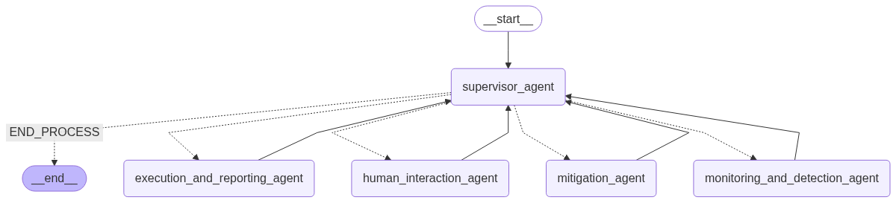

# Supply Chain Disruption Mitigation System (Multi-Agent)

This project implements a multi-agent system designed to monitor a simulated supply chain, detect disruptions, propose mitigation strategies, allow for human interaction, and report on chosen actions. It leverages LangChain and LangGraph for agent orchestration and LLM integration.

## Table of Contents
- [Introduction](#introduction)
- [Agents](#agents)
- [System Workflow](#system-workflow)
- [Setup](#setup)
- [How to Run](#how-to-run)
- [User Interaction](#user-interaction)
- [Dependencies](#dependencies)
- [Future Enhancements](#future-enhancements)

## Introduction
In modern supply chains, disruptions can lead to significant financial losses and operational inefficiencies. This system provides an automated yet human-in-the-loop approach to identify and respond to such events. It simulates a supply chain, introduces controlled disruptions, and then uses a series of AI agents, coordinated by a central supervisor, to manage the response.

## Agents
The system comprises five distinct agents, each with a specialized role:

### MonitoringAndDetectionAgent
- **Role:** Continuously monitors the simulated supply chain data.
- **Functionality:** Fetches current supply chain status, introduces simulated disruptions (e.g., production line breakdown, transportation delays), and uses an LLM to detect and describe any identified disruptions.

### MitigationAgent
- **Role:** Generates potential strategies to address detected disruptions.
- **Functionality:** Takes the disruption details and current supply chain data, and uses an LLM to brainstorm 3-5 distinct mitigation strategies along with their plausible short-term consequences. It can also re-evaluate strategies based on user feedback.

### HumanInteractionAgent
- **Role:** Facilitates human oversight and decision-making.
- **Functionality:** Presents the generated mitigation options to the user via the console. It collects the user's choice (selecting an option) or feedback (requesting re-evaluation with specific comments).

### ExecutionAndReportingAgent
- **Role:** Finalizes the chosen action and generates a report.
- **Functionality:** Takes the selected mitigation strategy and its consequence, and uses an LLM to compile a concise final report for a supply chain manager, confirming the action taken and its expected impact.

### SupervisorAgent
- **Role:** The central orchestrator of the multi-agent system.
- **Functionality:** Uses an LLM to analyze the current state of the entire system and decide which sub-agent should execute next. It ensures the workflow progresses logically from monitoring to detection, mitigation, human approval, and finally execution/reporting, handling loops for re-evaluation as needed.

## Architecture



## System Workflow
The system operates in a loop, coordinated by the SupervisorAgent:

1. **Start:** The SupervisorAgent initiates the process, typically by calling the MonitoringAndDetectionAgent.
2. **Monitoring & Detection:** The MonitoringAndDetectionAgent gathers data, simulates a disruption, and identifies it.
3. **Mitigation Planning:** If a disruption is detected, the SupervisorAgent routes to the MitigationAgent, which proposes solutions.
4. **Human Review:** The SupervisorAgent then routes to the HumanInteractionAgent, which presents the options to the user for selection or feedback.
5. **Decision Loop:**
    - If the user selects an option, the SupervisorAgent routes to the ExecutionAndReportingAgent.
    - If the user requests re-evaluation, the SupervisorAgent routes back to the MitigationAgent with the user's feedback.
    - If the user provides invalid input, the SupervisorAgent can route to END_PROCESS.
6. **Execution & Reporting:** The ExecutionAndReportingAgent generates a final report based on the chosen strategy.
7. **End:** After reporting, the SupervisorAgent terminates the process (END_PROCESS).

## Setup
To set up and run this project, follow these steps:

1. **Clone the Repository (if applicable):**
   ```bash
   # git clone <repository-url>
   # cd <project-directory>
   ```
2. **Create a Virtual Environment (Recommended):**
   ```bash
   uv venv .venv
   source venv/bin/activate # On Windows: .venv\Scripts\activate
   ```
3. **Install Dependencies:**
   ```bash
   uv pip install -r requirements.txt
   ```
4. **Set Your Gemini API Key:**
   You need a Google API Key to use ChatGoogleGenerativeAI. Set it as an environment variable:
   - Create an `.env` file
   - Add:
     ```env
     GEMINI_API_KEY=your_api_key_here
     ```

## How to Run
After completing the setup, you can run the multi-agent system:

```bash
python your_script_name.py # Replace 'your_script_name.py' with the actual file name
```

## User Interaction
When the HumanInteractionAgent is active, you will see proposed mitigation strategies and a prompt asking for your choice:

```
--- Proposed Mitigation Strategies ---
Option 1:
  Strategy: Activate backup production line 2 for Line 1's output.
  Consequence: Overall production capacity reduced by 20% for 3 days, but avoids complete halt.
------------------------------
Option 2:
  Strategy: Source steel from alternative supplier 'SupplierC' with express delivery.
  Consequence: Steel supply restored in 1 day, but at 15% higher material cost.
------------------------------
...

What would you like to do?
1. Select an option (type its number, e.g., '1', '2').
2. Re-evaluate (type 're-evaluate' followed by feedback, e.g., 're-evaluate too expensive').
Your choice:
```

You can respond in one of the following ways:
- **Select an Option:** Type the number of the desired option (e.g., 1, 2, 3) and press Enter.
- **Re-evaluate (with feedback):** Type `re-evaluate` followed by a space and your specific feedback (e.g., `re-evaluate these options are too expensive`). Press Enter.
- **Re-evaluate (without specific feedback):** Type `re-evaluate` and press Enter.

The system will then process your input and continue the workflow.

## Dependencies
- `langchain-google-genai`
- `langgraph`
- `langchain_core`

These are automatically installed via:
```bash
pip install -r requirements.txt
```

## Future Enhancements
- **More Sophisticated Simulation:** Integrate a more dynamic and realistic supply chain simulation model.
- **Database Integration:** Store supply chain data, disruptions, and mitigation histories in a persistent database (e.g., Firestore) for long-term analysis and learning.
- **Web UI:** Develop a graphical user interface instead of console-based interaction for a more intuitive user experience.
- **Advanced Feedback Loop:** Implement more nuanced ways for the MitigationAgent to learn from past user selections and feedback.
- **Real-time Data Feeds:** Connect to actual supply chain data sources (e.g., IoT sensors, logistics APIs).
- **Predictive Analytics:** Incorporate models to predict potential disruptions before they occur.
- **Cost-Benefit Analysis:** Enhance mitigation strategy generation with detailed cost-benefit analysis.
